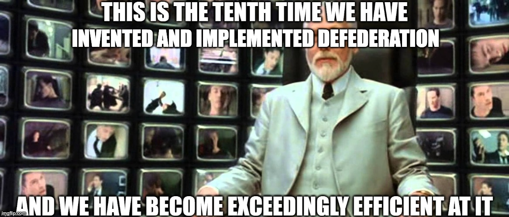
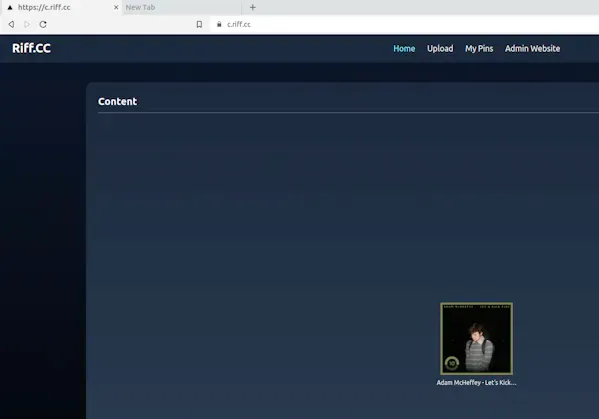
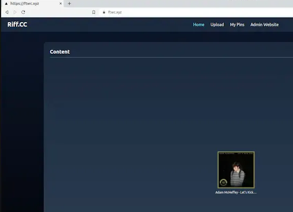
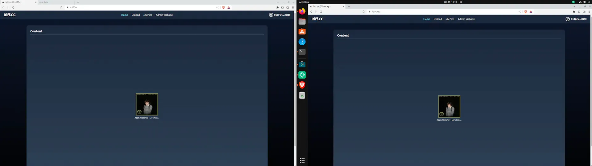
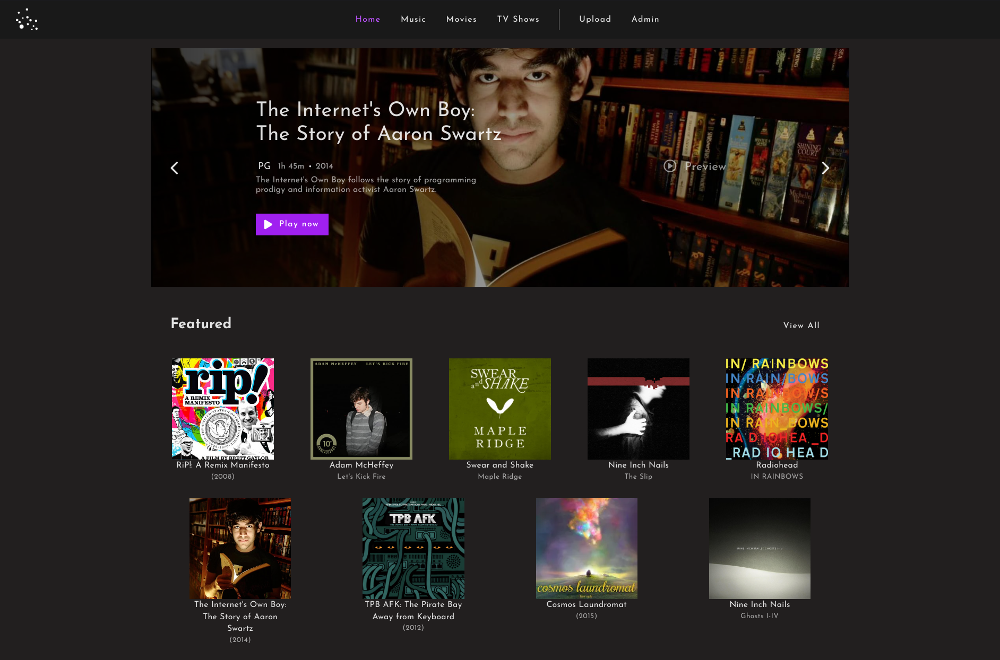
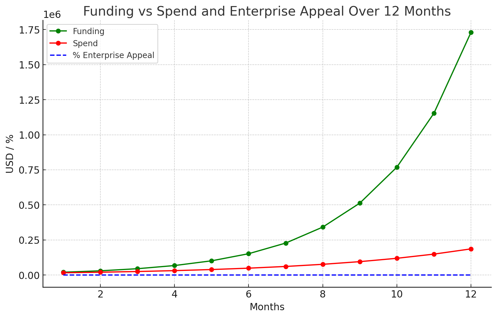

# Signals for Humans
This is an attempt to condense the original Signals paper into something digestible.

## Foreword
Today we're going to introduce a radically simple set of ideas,
flipping the usual way we think about building things on the Internet.

We'll talk about ways to enable use cases that are a natural fit for technology
we have already built and proven to work. A streaming portal for media, built on 
technologies that in their totality provide a solid foundation for Immortal Libraries.

To do this, we created something we now call The Defederation Model.

We'll get into what the hell Defederation is in a second.

We'll talk about the other use cases that could quickly be added to this foundation,
and how every single use case makes it more compelling,
more likely to be generally useful to everyone,
and our model for creating a positive feedback of people funding use cases that suit them,
including models for organisations and enterprises to contribute to the effort in a way
that provides immediate, tangible benefits to them.

Ultimately, this is a system designed to solve problems,
get better and better, reward early, mid and late adopters,
and to do so in a way that everyone can understand and participate in.

In some ways, these simple concepts are built around my life's work,
but are now so much better and bigger than anything I could have imagined.

Thanks for reading so far, enjoy the ride.

In a short, fictional future, grounded in the reality of today,

We will show you something.

E cinere, surgemus.

~ Wings

## Simple goals
We want to make a system that uses novel ideas and technology to make it easier and easier for people, companies, governments, and other organizations to collaborate.

Building from simple first concepts,
we will show a system that logically and mathematically
builds towards a self sustaining ecosystem anyone can take part in,
that anyone can contribute to and benefit from,
that is flexible and easy to understand when put in the right terms,
and is compelling enough to draw more and more value into it, 
creating a positive feedback loop.

Unlike past systems like that, this is explicitly designed with neutrality and fairness in mind,
with a focus on creating a system that is maximally fair and neutral,
with a focus on actually solving problems and making it easier for people to work together,
and making it easier for people to make money by working together.

There is no authority, no central points of failure, no centre to the project -
not even Riff.CC, The Riff Project or Riff Labs is ultimately necessary
to make this system work once we have built an ecosystem that is self sustaining.

How does this let you build a different kind of website - a lens - and from that a different kind of internet - and even maybe something more?

The implications get wild.

## The Defederation Model
The core of this entire concept is a cooperative protocol called the Defederation Protocol. Much in the way "copyleft" exploits copyright to further freedom instead of limit it, Defederation exploits the concept of federation in an unintuitive inverse tradeoff, to further freedom instead of limiting it.

This is achieved with a combination of a cooperative protocol and a new kind of network structure.

It might be most useful, however, to start by thinking about what a normal internet website might look like.

### The Library shall not fall again.
Every library in history has fallen or, at some point, will fall.

However, digital libraries should in theory be impervious - as something that can be copied endlessly, why should we ever accept the total loss of one?

While that is a noble and reasonable thought, it does not reflect reality.

Data is hard to move, by definition, and metadata even harder - then databases and user data even worse. In its totality, shifting a website just among its own owner from one side of the United States to the other should be as easy as a matter of minutes, but in practice it is a monumental task, for a company of any sufficient size. And maybe even especially for small ones.

So when a website is threatened, what happens? Could you build the immortal Library - with the capital L?

How?

### A Normal Website
Let's explore a simple website - ftwc.xyz. In reality, ftwc.xyz is our test lens, used for helping prove the Defederation Model and Protocol, but in this example, we'll pretend it's a normal website.

ftwc.xyz - "for those who create" - is a website about creativity.

We'll say they have 1 million users.

It has fifty thousand videos on it. With an average size of about 4GiB each, this means it has to keep track of about 200TiB of data. This is a significant expense for a normal website - and it's only going to get bigger.

Any seriously large video website will have even bigger problems than this, but you can already tell this is going to be a bag of hurt in terms of cost.

If they need to keep useful copies of the website active, they'll need block storage - not object storage. Object storage is a good solution in a lot of cases, but for ftwc.xyz, it's a non-starter. They have to encode their videos sometimes, and that means S3 becomes a pain, not a blessing.

Furthering that, they have to cope with sustained bursts of heavy traffic from legitimate users. So they need to keep a lot of servers online.

Thirty 1U servers, each within a 42U rack, could be a pretty normal setup for a website of this size.

On top of that, they might even resort to distributed storage, such as Ceph, increasing cost and complexity further.

At least three loadbalancers are required to reach a quorum that allows them to keep everything online even if a machine fails. They have to get enteprise grade everything, and invest in extremely expensive network cards. Extremely expensive SSDs.

Not only that, they need to keep enough copies of all of these videos to keep them at useful, stable speeds even with lots of people trying to watch them at once. 

They need a CDN like Cloudflare to keep them up and online through high load and DDoS attacks.

And they need to keep track of all of this metadata, and the databases that make it all work.

So they need database servers - and they'll need three for MySQL or PostgreSQL and just about any database with consistency and high availability.

They'll need webservers, and of course, three - for high availability.

They'll need to have, at minimum, triple redundant networking gear, absolutely ridiculous levels of redundancy at every level - remember, with a million users, the stakes are high.

Heck, they even need Ceph storage, because their use case is very specific. So it gets even harder, because not only is Ceph complicated - it's practically a fulltime job to keep it running.

So they invest, and invest, and invest and tune, and one day, at the busiest peak of the season, their website goes down.

The database server just failed, and they have no redundancy. Not only that, they might not even have backups.

In short...

And that wasn't even the point we actually need to talk about - the cost!

Triple redundancy at every level, and you're looking at a quarter of a million dollars a year. Just to keep the lights on.

That may not even include staffing, and other costs. Administration overhead. Security training and services. Firewalls. Enterprise licenses for everything. VMware or OpenStack.

So great, they either go out of business, or hopefully they had backups - which, thank goodness, they did.

But now they have to rebuild.

And so this website, which as a reminder consists of:
- 50,000 videos
- 30 webservers
- 3 loadbalancers
- 3 database servers
- 3 racks of servers
- 10 Ceph servers (to run the storage - at an approximate cost of $100,000 a year)
- 200TiB of data plus replication (~500TiB total, costing $100,000 a year alone)

So redundant, so powerful, designed never to fail and now...

Has to be rebuilt.

### So The Normal Website Rebuilds
They restore everything, but when they bring the site back up, they have another problem. Nothing will load. They look into it and quickly realize the problem - someone moved the files. Everything is now on a different server, and they don't even know which one - or why - and now they're down until they figure out where it is.

At this point they start crawling their entire infrastructure to try and find out what happened. Eventually they find the files and restore them, but by this point it's an international incident. Governments actually had private contracts with this website to host training videos and other important internal video material for their employees. Now they're down, and angry.

What went wrong?

Well, it's mostly this:

`https://myfavouritewidgets.corporate/files/videos/wp-20240920-final-final6.mp4`

Specifically, it's this bit - `myfavouritewidgets.corporate` - and this bit - `/files/videos/` - and this bit `https` - and this bit - `wp-20240920-final-final6.mp4` - because, are you getting it yet 😱 any of these changing in any way at any time will break the entire website.

If it's a file that matters, boom, you have an outage and pissed off users. 🙀

So what can we do differently here?

### Enter Challenger 1: BitTorrent
BitTorrent provides a partial improvement to this. By allowing people to directly help participate in hosting and distributing the files for my website, now I can strike off some cost.

Instantly, nearly half of the cost is gone.

That's huge! But you still have a major problem.

If the main website with the BitTorrent tracker goes down, here's what happens:
* The website goes down
* The BitTorrent tracker goes down
* The files might technically still be out there, but someone has to go find them on their hard drive and manually re-seed and re-upload them to a new tracker.
* If the servers go down, everything stops.

It's closer to a better library, and is an improvment, but ultimately still very vulnerable.

### Enter Challenger 2: Cloud Storage
Cloud storage claims to be a solution to all problems, but as some like to say - "it's just someone else's computer".

It has all of the same challenges as the traditional website, but with an added cost and complexity. It may even have lock-in exit fees.

### Enter Challenger 3: IPFS
The InterPlanetary File System provides a fascinating partial improvement.

You can use IPFS to distribute data amongst your community, then as long as anyone who has a CID (essentially just a representation of a file, a hash*) is online and reasonably reachable for you, you can access the file.

Moreover, you can run an IPFS Gateway, and now users can access any file on IPFS (or just files you've pinned to your gateway, whichever is preferred) through standard HTTPS.

This is great! But you still need to run 3 silly servers! And 3 loadbalancers! And 3 routers! And you need to keep track of all the CIDs!

(* Technically, a CID is not just a hash, it's a hash of a Merkle DAG, but that's not important for this explanation. And in practice, just think of it as a hash. It's fine.)

It means that technically even if your site was to be destroyed, your users could still access the files - at least for a time - but only if they had saved all the CIDs for all the files, and only if the users who had the files realised keeping their IPFS nodes running would help and was a good idea.

In practice, even this wouldn't help much.

And on top of that, keeping regular dumps of all the website's files, code and data would become onerous, and may even risk exposing PII if the regex isn't perfect. And now you're relying on others to be keeping recent backups of the site.

**Can we build further from here?**

### Enter Unusual Suspect 1: The Traditional CDN
Bunny.net (unaffiliated with Riff, we're just fans 😊) provides a very good overlay over IPFS, and allows you to use a CDN to access your files.

This means any slowdown caused by IPFS doing retrievals over Bitswap can be papered over by the CDN, and you can continue to use your existing website and infrastructure.

Since CIDs are fixed once created (unless upgrading to a new hashing algorithm or CID version), you can just set the caching time to a year. Now people must be more careful, increasing your team's base stress level.

But you've now got a system that is orders of magnitude cheaper, orders of magnitude easier to manage, and orders of magnitude more resilient.

So now we've made our site fast in any region, which is a huge improvement, but we've also made it so that we can survive almost any black swan event.

### Enter Unusual Suspect 2: OrbitDB
OrbitDB is a database protocol built on top of IPFS.

It allows you to talk in a common language to other peers - browsers, runnning IPFS and OrbitDB - allowing you to host your entire website's database - the database itself and everything about the site - on a decentralised group of volunteers. Essentially, using the site, you donate a little bit of your compute's bandwidth to act as a sort of distributed storage layer.

At this point, we now have a system that is orders of magnitude cheaper, orders of magnitude easier to manage, and orders of magnitude more resilient. Adding OrbitDB effectively means that we don't *technically* need anything to be hosted by us, except for these remaining components:

* "Meet-me" server (WebRTC Relay) to allow for direct connections between users
* A CDN to act as a cache layer for the website
* Three IPFS gateways to allow dialing content

Total cost to run a site at this point is not only less than $1000 a year, but could plausibly be less than $150 a year.

Now you've got something that's cheaper to run, easier to manage, and more resilient than anything else on the market that isn't also doing the same tricks.

But there's two final flourishes, because ultimately we haven't solved the biggest issue with the website.

***Us***.

### The Cluster
Even if we went to this point, we still don't even have a library that we can sustain yet.

Simply put, we can use IPFS Cluster - this allows us to not only maintain a list of "pins" of content
to keep available and online via IPFS on our own servers and nodes, but also allows anyone else who
wanted to, to be able to join and help distribute files.

Launching an IPFS Cluster is easy, and essentially allows your users to help act as the true hosts of your website.

Plus, Orbiter will soon be upgraded to distribute pinning of the OrbitDB database and data itself, 
allowing for total resilience.

This is close. We're not there yet, but we're close.

### The Lens

Ultimately, we've built a very resilient *library* at this point, 
but it will NOT, no matter how much we improve it, out live us -
without serious manual intervention, one day this library will fall like any other.

This is where Defederation comes in. Instead of a website, we decided we now have a Lens.

A Lens is simply a way to make your own website or platform (or app!)
by being able to split, merge and fork the work of others.

The main thing we wanted to resolve is fairly simple:

* It's very likely Creative Commons would love a platform like Riff.CC 
(we've had some conversations and they loved it years ago before we were cool!)

* We want to help contribute massively to the Creative Commons ecosystem.

* But they don't need another website that someone else runs.
    * Something that someone else can upload things to
    * And get them in trouble if they do something wrong

How can we do what Riff.CC was originally intended for, 
that Unstoppable Library concept, but without the need to rely on us?

Simple - we make us irrelevant and yet helpful. Let me explain.

With Defederation, now we can make Riff.CC a Lens for ourselves. 
It will contain nothing but our site running on Orbiter,
with all metadata in OrbitDB*
(* really, Constellation, which is a wrapper around OrbitDB
Shoutout Julien.) and all the files in IPFS.

What's special is what happens for Creative Commons now. They can simply load our Lens,
go the settings and grab our site ID (a Defederation key), log into their owns Lens as
an administrator, and then "follow" or "trust" our Lens.

This is real technology, simple to implement, and it works.

> [ed's note: okay, simple is a massive exaggeration, but it's simple enough we've done it three times now.]

Here's what happens next, as shown by what we consider our first "true" Defederation implementation:

From "c.riff.cc"'s perspective - just a normal Lens, running Orbiter, and you can't really tell it's in IPFS and OrbitDB at all...

Normal so far, right?

Here's an entirely different Lens, running on a different server, on a different continent.

And it doesn't have any of the files or content at all.

We:
* Uploaded an album - Adam McHeffey's "Let's Kick Fire" - to our Lens, Riff.CC
* Uploaded a different pin on FTWC.xyz (our demo lens)
* On FTWC.xyz, we then "follow" Riff.CC
* And suddenly...

Both lenses have Riff.CC's content, but technically it only "exists" on Riff.CC's Lens.

Both sites remain sovereign and completely separate and independent, but you already
can't really see any difference between them. 

In fact, behind the scenes, either site can actually change
and edit the content on their site - if it differs from the lens it comes from
(such as if FTWC is deleting a pin that Riff.CC has uploaded, or vice versa)
then only the lens making the change will be affected - preserving the original.

We then did the same thing in reverse, uploading a pin to FTWC.xyz, and then having
Riff.CC follow it.

> [ed's note: Sadly there's no screenshot of that bit, we were too excited to document as well as we should have]

Why are we now irrelevant, yet important?

Simply put, we're now a Lens, just our view of the world - but we can change what we see.

If we want to, we can upload new stuff to our Lens and it will appear on both places!

If we don't do a great job, now FTWC can remove items or even choose to defederate from us by unfollowing.

Now we have a system where we're completely separate from each other,
and yet we act as one. FTWC and Riff.CC could be literally and completely different,
run by different people, from different continents,
and yet this would operate as one.

Moreover, now if you got rid of either Lens, everything would be preserved by the other!

This is finally the Unstoppable Library - not by being uncensorable through thumbing our nose at the law or the man - because each Lens on the clearnet Internet is still ultimately just a website someone is responsible for - but by making it so easy to pick up our work that it WILL by definition outlive us as long as even one person wants to keep something going from it.

It is the mark of the last library to fall,
and the first Library.

## Riff.CC, The First Lens and the First Library
This places Riff.CC in a very unique position, already something vaguely historic.

It's the first Lens, and will be a purely Creative Commons and Public Domain Lens,
holding the first and only unstoppable Library of copyleft and public domain works.

It performs *faster than Netflix* in some tests (buffering and loading speeds are perceptible improvements over Netflix under ideal conditions, and just about comparable in real world conditions).

It runs on a semi-impossible to censor network that spans the entire globe, and is fully permissionless.

It is fully open source, and as long as you follow the AGPL, you can use it as the base of your own project.

It is also fully interoperable with other Lenses, meaning you can follow another Lens and see their content in your feed,
and you can merge with or split from them if you so desire.

This is already interesting, and we're almost ready to actually throw open our doors.

And it's *gorgeous*:

Heck, you can actually use it today, while we're working on it! It's at https://orbiter.riff.cc - every single time we push a new change, and it passes tests, it makes it there.

We're putting some final polishes on it:
* Making sure every piece of content is playable, pulling together years of development
* Fixing a few quirks and fleshing out the user experience
* Bringing back true Defederation support (which we've had in Orbiter before) since we turned it off for the redesign so we could focus on just UX.

Once it's back, it'll look and feel EXACTLY as it does now - 
but what you won't know is that behind the scenes, we're just a Lens,
with fully half of the content on the site existing on a completely different Lens - FTWC.xyz, with which we share no common infrastructure *at all*.

Our network of users, running Orbiter and IPFS + IPFS Cluster Follower, are the thing now supporting our entire site at that point.

And finally, Riff.CC will be considered publicly launched to the world at large - completing a dream that started in 2009.

Exciting, right? Well, it's just the beginning.

## The Accretion Model
Think carefully - what is Defederation truly? Not a technical system - not really - 
Defederation is now a social protocol. And it encourages cooperation. We can build from that.

What if we could start an entire ecosystem around the original Riff.CC concept, split out the software into its own properly separated project (we're calling the Pioneer Ecosystem, in honour of **Pioneer 10**) and begin a "flywheel of development" where we could add new features and use cases to the platform at an exponential rate?

Simply put, we've made it so easy to bring ANY website into what we've built, and anything we can do with OrbitDB and IPFS is now something that can become a **use case** for Orbiter - an Orbiter Module.

Here's how it works:

* Riff Labs, as the main sponsor of Riff.CC so far, finds a client who wants their use case built and made available as an Orbiter Module.
* Thanks to the AGPL, we are essentially required to keep this new module open source.
* However, for the cost of the average module ($10K-20K depending on complexity), it's worth getting Riff Labs to get it built for most clients, even if they don't end up with total control over what results.
* Riff Labs will build something that would cost them $200K+ to develop - which might still never be able to match our system in terms of being Library-like! - and then the client gets to use it for whatever they want, totally open source, forever.

In basic terms, we're so cheap even those with secret, cool use cases will consider us. This is the main strange property we've now created - and forms part of the Accretion Model.

*Via [Wikipedia](https://en.wikipedia.org/wiki/File:Black_hole%27s_accretion_disk.jpg), CC-BY-SA-4.0 International*

As people become drawn to the ecosystem, they add their interest or their own funding and modules, and the flywheel spins faster and faster.

We can actually also make this attractive to people wanting something proprietary:
* We do the same exact process, but instead of forcing them into making their entire solution AGPL...
* We split it into smaller components that are individually useful but don't solve their specific problem
* Then we allow them to configure modules together to solve their use case.

This allow us to allow them to technically comply with the AGPL, and even its spirit - contributing truly useful building blocks for other things - and still giving them the benefits of later developments by the Ecosystem when their modules are later improved.

While still allowing them a proprietary solution and advantage.

For companies who simply make their entire solution fully open, we give them a 25% "discount" on development, and either way we credit them with contributing to the Ecosystem.

*Via [Wikipedia](https://en.wikipedia.org/wiki/File:GravityPotential.jpg#file), CC-BY-SA-4.0 International*

It **accretes**.

We then introduce the concept of the "Pioneer Toolbox" - the ability to use a visual editor to drag and drop...

not just modules together - to build your own Lens...

not just media, to upload to your Lens, and anything else you can do with your modules...

Not just content from other Lenses, through Defederation...

But ***entire lenses including content from any Lens you want***.

Even ***entire modules you don't have yet*** - the most instantly useful thing on the market.

And what's more, we can even do this *privately!* within companies, allowing anyone to build their own private lenses for their own use, and instantly collaborate in deep ways with other companies.

## The Accretion - The Ultimate Flywheel
Already, we're looking at roughly this if we have even half competent attempts at marketing and outreach:

It looks amazingly optimistic, but here's what it's based on:

> Funding Growth: Funding grows exponentially over the 12 months, rising from an initial $20,000 to nearly $1.73 million by month 12. This reflects the increasing appeal to enterprises, as well as the broader adoption of the Riff platform.

> Spend Growth: Spend also increases over time, but at a slower rate compared to funding. By month 12, the projected spend is around $186,264, which is significantly lower than the incoming funding. This suggests a healthy financial buffer that can be reinvested into scaling operations, infrastructure, and development.

> Enterprise Appeal: Enterprise appeal starts at around 5% in the early months but rises sharply to 85% by month 12. This shows that as more enterprises understand the system’s advantages—cost-efficiency, decentralization, and trust-based collaboration—they are increasingly drawn in.

It *accretes*.

## A New Ecosystem
We quickly become one of the most useful tools in the world, yet controlled by nobody, with no investors.

No single point of failure. No need to answer to any party, and yet - nobody harmed through our actions, and no control we don't need to have.

Even more unfairly, once developed further, Orbiter lets us:

* Near-instantly distribute upgraded versions of any Orbiter Module to all users
* Outperform just about any centralised solution, forever
* Begin to accrete almost every use case into it, becoming a truly generalised solution

We then begin making our own strategic accretions.

### CryptPad
We take the open source code of CryptPad, built on excellent cryptographic and security primitives and known to be one of the most secure Office/Productivity suites in the world. It even has the same collaborative editing on a single document that Google Docs and earlier things like Etherpad made so popular.

By spending a few weeks converting it to a module, creative enough early adopters can now use it on their Lens, public or private, and *replace Google Docs or Microsoft Office* without having to create a centralised CryptPad server.

We can make the interface look and feel as a a native Orbiter Module, and we can even make it easy to export an entire folder out so you can take it to a CryptPad server anywhere and exit the ecosystem. We *want* to enable absolute freedom of choice - because that helps us to be so attractive that we can accrete.

### Bookmarks
We can build a simple bookmarks module, to allow people to collaboratively trade bookmarks with each other. This wouldn't take a lot of effort, but instantly makes us more useful.

### Calendar
Same sort of idea.

### Personal booking system (a la Calendly)
Then we do this too.

### Meetup system
Now we add a module to allow people to host and organise meetups...

### Geocaching module
Now we add a module to allow people to collaboratively geocache...

### ...
and then anything we can think of that will help real communities and physical libraries, charities, schools...

### The Accretion Continues
It already feels somewhat "unfair" to everyone else on the market. 

But it's important to remember that we're not competing with them. We're accreting them.

Nobody is forced, nobody is harmed, we're just simply cheaper and better and compete in ways that nobody can really compete with yet. And we build the ecosystem intentionally in a way that anyone can build their own modules and build use cases on top of it.

Slowly, and then all at once.

It accretes.

> Number of Modules (blue line): The growth in the number of modules is exponential, starting with just 10 modules and rising to 3,427 by month 12. 

> This reflects the accelerating pace at which developers and users are building and sharing their JavaScript-based apps within the ecosystem. Each new module adds more functionality and extends the reach of Riff's Orbiter system.

> Number of Lenses (orange line): The number of lenses also grows exponentially, starting at 5 and reaching 432 lenses by month 12. Each lens can accrete modules and potentially other lenses, allowing users and organizations to build rich, multi-layered ecosystems that interconnect and enhance functionality across the network.

Once we truly launch the Pioneer Ecosystem, we'll very quickly see a hockey stick effect that only gets faster and faster and faster with everyone who joins.

And it forces a **positive sum game** for everyone involved. Cheaper and better than anything else, encouraging open and free collaboration but allowing for private collaboration.

Compatible with existing power structures and relationships, but not dependent on them.

It makes sites like Tumblr possible to run today at effectively zero cost - which means no ads, and soon sites like Spotify are possible to run at effectively zero cost too.

One day, sites as large as Netflix and Facebook will be possible to make Orbiter alternatives to, and they'll be cheaper and better than anything else. Nearly completely free.

And this technology is real *today*.

### The Accretion is Complete

Before long, we have accreted just about 80% of the use cases that most people would want. At minimum, almost any company would find us interesting - especially if we can make it so they can use it to build their own internal tools.

And now anyone in the world - now revealed as not just any person - any company - any entity or group - any project - even any government - can use it to build an extremely powerful and personal front page showing everything they care about and/or love or want to identify with.

We give everyone their own total identity, their own personal Library - but notice the L, this is a true Library, and has all the properties of Riff.CC.

Moreover, we can allow users to use our CDN and gateway for their own Lenses, eliminating the need for them to worry about any of that detail. We can potentially charge them for it, maybe above cost slightly, but honestly we don't even need to.

Users using our CDN and gateway will be charged not to pay for it, but to make sure they are not simply abusing it to spread bad content - it's a verification thing, not a money making thing.

### Going Vertical

So we make a hosting service on top, where we'll give you a click-to-buy Lens, and all a user will pay for is:

* A tiny amount of storage, 100MB or so, to enable their Lens
* Enough bandwidth to support their use case
* If they want to bring their own domain, the cost of that
* If they use our domain (nameoflens.pioneer.eco) they'll pay nothing for DNS/Domain costs.

Your very own Lens, forever. As long as you behave according to our ToS.

This could plausibly be as low as $50 a year for any user who wants *their own custom and personal domain* and as low as *$10 a year* for anyone else.

So now you can have the most personal and powerful website you've ever had,
built on all the things you think are important or cool or speak to you,
and you can do it so cheaply it's almost free, even for those from relatively poor countries.

Suddenly, we've not only created the best Libraries and the most powerful Lenses ever made, but we've also built a system so cheap that...

**We can actually host a Lens for every single person on the planet, for a nominal cost to us of about $10,000 USD a month**

At that point, with the Flywheel spinning so fast we can no longer develop fast enough to spend the money, we can hire developers, bring in outside parties to help flesh out the ecosystem, and increase accretion even further.

Everyone who donated a module by paying for its development and getting it added to Orbiter now becomes an early "Pioneer" - and their use case gets fixes automatically as the community grows and works on the ecosystem.

They get automatic upgrades, for free, forever, as long as anyone cares enough to improve their use case,

and they get a system that lets them **collaborate seamlessly**.

The final unfairness - *anyone* can run this kind of service at this point, too, and **we will actively help them to do so if they want to**.

Instantly, an entire new market opens up allowing people a true freedom of choice never really available before.

## The Collaboration
Think about what this now does for collaboration.

I can:
* Share and edit documents with anyone from across the world,
  without sharing any keys to my infrastructure or letting them access anything I don't want them to.
* Collaboratively build up media libraries, or even entire websites, without needing to know Git, or even understand the underlying technology.
* Run our own private networks, or even private lenses within a company, without needing to know or care about the details of how it works.
* More and more use cases.

What if we now enabled scientists to swap scientific papers and data with each other?

Teachers to trade lesson plans and collaborate on new forms of education?

Countries to work with each other for the common good, building shared papers and international treaties, with less friction than any existing system? Could the *UN* use this to be more effective than it is today?

From here, we start to see what this truly is - not just yet, but close - a ***collaboration engine***.

# Things Get Weird
From here, we don't really know what happens next, but we are starting to see something.

## The Collaboration Engine
Once the Pioneer Ecosystem takes hold, we start to see people in a situation where a strange thing has occurred - the incentives for everyone involved are *aligned*.

Incentive Alignment simply means that the needs of the users and the needs of the hosts of the website or Lens are aligned in such a way that the user is truly getting what they need, and the host is truly getting something they need in return.

The short way to put it is, incentive alignment is critical because it means **you are not the product** - in direct contrast to the current enshittification the Internet seems to be going through and terminally suffering.

But it's more than the Internet.

## The World's First Collaboration Engine
A collaboration engine allows parties - who may not even know or trust each other - to work together seamlessly on common goals.

Already, with Defederation providing a seamless way to work together - to do science, to reduce social issues and improve education - all the things that start to bring people together inherently. That might almost be enough.

But if you work on something with someone, and they dislike you or your actions, they can exit and simply defederate at no penalty. This is great! But the problem is "defederation" is a global action. It's got a lot of gravitas to it!

What if defederation was the norm, and everyone was used to people just coming and going from any company or power relationship when it stops suiting them?

What if you could work with someone, and if they did something you didn't like, you could just leave them and go work with someone else?

What if you could *keep working with them on the things you still agree on*?

This simple change to Defederation makes it the first of its kind - an engine for forcing collaborative, positive sum games among even your worst enemies and most bitter rivalries.

In short, the miracle of collaboration that once occurred between Turkey and Greece - now famous as [Earthquake Diplomacy](https://en.wikipedia.org/wiki/Greek%E2%80%93Turkish_earthquake_diplomacy) - now occurs between everyone. ALL THE TIME.

Of course, people will always find ways to find conflict with another. But it's genuinely very hard to hate your neighbour when you know they saved your nephew's life. Or created your favourite song.

Simply put, it's cheaper, easier and better to participate and work together in ALL cases.

## What does the Prisoner's Dilemma now look like?

Enter the classic Game Theory classic - the Prisoner's Dilemma.

In the Prisoner's Dilemma, two people are arrested for a crime. They are taken in for separate interrogations. The police tell them they can either:

* Cooperate, and they both get 3 years if either defects
* Defect, and they both get 1 year if both defect

If both cooperate, they will both go free with no consequences.

Despite the fact that the best move for everyone involved is to cooperate, the best move for each individual based on their risk factors, their incentive alignment and their own personal interest - is to defect.

Both know they'll hurt both parties if they defect, but they both do the math, and even if one of them decides to do the "right" thing, at least one will probably lead to both parties being screwed.

But now we've flipped this. We've made the first **Inverse Prisoner's Dilemma**.

## The Perfect Game Theory
Defederation is a form of "perfect game theory". In all cases, the best move for everyone is to cooperate. Always.

### Bad behaviour is punished
In Defederation, bad behaviour is punished in a way you might not expect.

Word spreads fast. As a peer-to-peer network, you can easily have a reputation system that runs along the rails of Defederation. Adding such a network, which we have a design for that we've already taken to logical conclusions, means that bad behaviour is punished in a way that is very hard to live with, yet not unfair and entirely self-correcting and self-inflicted.

Bad actors such as hateful groups are quickly and safely isolated and ostracised out to their own corners - only able to play in Lenses that they control themselves or that are controlled by likeminded groups. This sounds like putting all the bad eggs together - and it is - but it also accretes so much power and value into the good actors and gives them such overwhelming advantage that they can easily out-compete the bad actors.

In such a system, everyone who wants to be part of the real world must play by at least the rules of the people or groups they want to work with.

### Punishment is swift and severe
Any bad behaviour can be punished instantly and severely - if you do something horrifically bad in this system, you will instantly start to be defederated, severed from the network of people who were angry at your actions.

Without any central authority to meter your punishment, you are silently and carefully extracted from the ecosystem. Your contributions are not deleted, but you are no longer part of the world you were.

### And yet
This system is not actually harsh. It is actually quite soft.

People are simply allowed to leave. They are not punished. They are not even made to feel bad. They are simply allowed to leave.

In such a system, the punishment is self-inflicted and completely fair and voluntary - the perfect embodiment of the classic "FAFO" ("and find out") idea.

Sybil attacks, previously thought impossible to solve and defend against, are essentially impossible.

### Fair and balanced and voluntary
In such a system, even the worst punishment simply means you are so damaged reputationally that you do not ever want to be exposed to it, yet nobody has to use any form of force or harm to make you behave.

Some will still cause issues, but they will be so few and far between that they will be easy to deal with.

The other interesting property here is **the lack of universal morality** - compatible with all existing structures, yet not beholden to any of them. Simply because someone rejected you and defederated you, you are not forced to change your beliefs or actions.

If the groups you work with are okay with what you've done, and those who they associate with are okay with it too, your actions will always be fine.

And if you don't find that works well, you can simply find some other group to go to.

**Freedom of association** as a protocol and technology, encoded now into the very fabric of collaboration.

### Privacy
In such a system where you are no longer the product, the *incentive alignment* says you no longer need aggressive tracking to make advertisement work. You don't need advertisements at all any more.

Lenses could in theory put in ads, but honestly, their users will usually then just flock to Lenses who don't use advertising.

End-to-end encryption for most use cases gives people an assurance of true privacy.

So really, at that point there's no need for any sort of privacy invasion.

***Which makes the flywheel even more unfair, because now we're faster and lighter than any of the centralised alternatives.***

For people in the third world, or poor areas, really any person with a lower-than-midrange spec laptop or device - we are now the best possible option, automatically, simply because of the incentive alignment.

### Making It Real: From Collaboration Tool to The First Collaboration Engine
Simply put, this is the final part of the puzzle - by making sure this system is a fair and powerful ecosystem, which anyone can be any part of - and then ***making Defederation be a lighter and less dramatic action by allowing people to defederate along a particular topic instead of an entire entity***....

We build the first ever collaboration engine.

### The implications for the world
Such an engine would beautifully start to solve so many of the world's problems.

In less time than one might think.

* Thanks to "Earthquake Diplomacy" now being seamless and easy, we'll see some of the worst and longest conflicts in history begin to abate and resolve as parties begin to find common ground.

* Thanks to better science collaboration, slowly we'd see the entire current scientific community slowly transition from the current slow and heavily controlled and owned system,
towards a system that is open, collaborative and global. 

The impact on science would be profound within **months, not years**.

* Thanks to better education, we'll see the world's education systems start to transition from the current slow, controlled and biased system, towards a system that is open, collaborative and global. It will be normal to work on a course with people from around the world.

In short, the best summary for technical people is this is just "Git but for entire societies", but to really send it home for you:

* Continuous, open-source, global, collaborative development of all the things.
* Forking and merging of efforts, effortlessly, on a global scale.
* Communities that can build in minutes from thousands of lenses.
* The ability to fork and merge entire societies, and to do so effortlessly.

Very quickly, the dream of the Network State becomes a reality - but not a single one that becomes a source of power and oppression and could have the potential to be a totalitarian nightmare - a million powerful Network States begin at similar times, ensuring nobody can ever seize power, and the very nature of Defederation is now also made clear - 

it tends to reduce centralisation over time as an inevitability, because the best ideas and the best people will naturally congregate but not be centrally controlled, available to everyone. While clusters will form as ever, the zero (and in many cases BELOW ZERO) exit cost means anyone can compete with anyone on a level playing field.

Capitalism works well under this system, eliminating most of the concerns of "late stage capitalism" by eliminating the zero sum game entirely, but allowing the positive aspects of productive capitalism to still help and improve everything.

Systems of democracy benefit under this system, able to improve the efficiency of bureaucracy, and everything slowly and then faster and faster becomes more efficient and fair.

Entire societies can reshape and transition, slowly and without harm, to a more fair, voluntary and productive system.

And so on.

### The end of force?
This is the most significant change of all.

With this new system, the need for force to maintain order disappears entirely.

Anyone who uses force to maintain order is quickly ostracised and defederated.

It won't happen overnight, but eventually the need for force is gone.

Peace and order can now be maintained with a voluntary system, with self-correcting and self-enforced punishment that is privacy-respecting, gives everyone full autonomy (more than the current systems!) and so powerful that in practice just about nobody will ever really want to use force again once this becomes normal.

Such a world is hard to imagine, but think about it - if you never ever needed to hurt or harm someone again, would you still find reasons to do so? Really think about it.

# What Comes Next?
Now we've made the first **cooperation engine** and we've built it from first principles in front of you. 

It is real, and it works, and it is potentially the most significant contribution we'll make to the world.

Rather than fighting the existing power and money in society, this **absorbs, accretes and eventually diffuses it** - and the peoople who benefit most is at first the existing power holders!

In such a system, everyone's only winning move is to play.

# The End of the World
> "Oh, and your poet Eliot had it all wrong,
> THIS is the way the world ends.
> 
> A friend of a friend."

\- Cortana, via [The Cortana Letters](https://halo.fandom.com/wiki/Cortana_Letters#Letters)

## The Shoggoth Revealed
1. **Addressing Current Challenges**
   - Centralized power structures can stifle innovation and limit personal freedoms. The Cooperation Engine offers a solution by decentralizing control and fostering voluntary collaboration.

2. **Empowering Individuals and Communities**
   - Participants have the freedom to choose their collaborations, ensuring autonomy and enhancing personal agency. This system promotes a culture of trust and mutual respect.

3. **Innovative Framework**
   - The Cooperation Engine is built on open-source, modular components, allowing for continuous improvement and adaptation. This flexibility encourages innovation and reduces operational costs.

4. **Real-World Applications**
   - By applying this system to industries like healthcare, law, and education, we can create community-driven solutions that prioritize privacy and personalized data control.

And most wildly of all, this system provides the following previously incredibly sounding claims:
* A solid framework for Superalignment of all AI systems.
* A solid framework for a global, open-source, collaborative, decentralized, censorship-resistant, end-to-end encrypted, collaborative media platform.
* Moves the world closer to post-scarcity over time
* Obsoletes copyright gently by making it unnecessary to find adoption and success and earning enough to live on.
* May be the holy grail of game theory, social justice, AI alignment, international diplomacy, science collaboration, education...

Many, many things from one.

## Building Towards Transformation
As the Cooperation Engine gains traction, its potential to drive significant societal change becomes evident. By fostering collaboration and trust, it lays the groundwork for a more harmonious and resilient society.

We are not unaware of our place in this, so let's make our position clear:

Our internal slogan for our team goes as follows:

> "We'll be a small part of something big.
> 
> But a meaningful part we can be proud of.
> 
> And we'll enable others to do big things."

This is not just a slogan, it's our Prime Directive, to remember that no matter how big and important The Riff Project becomes to the world,
we will always be a small part of a big thing. We will always work to ensure this - enabling others to do the big things.
We'll be a force for good and freedom and sovereignty, and will make massive change happen without so much as a stern look.

With the new clarity found at the end of nearly 14 years of work, seeing what we actually accidentally stumbled upon - the Cooperation Engine - we can now see the path forward.

So we also came up with a new motto, based on our previous philosophy:

*E cinere surgemus*, previously meaning "Out of ash, rise (singular)" and with many intentional meanings, joins with a new slogan:

> E pluribus spes uni, spes omnibus

Out of many, hope for one. Hope for one, hope for each, hope for all.

Combined, they make the ultimate mission statement for The Riff Project:

 > ### Out of one ash, rise.
 > ### Out of many, hope for one.
 > ### Hope for one, hope for each, hope for all.
 {: .blockquote-large }

The Cooperation Engine is more than a technological innovation; it's a pathway to a future where collaboration and trust are the foundations of progress. By participating, individuals and communities can help shape a world where freedom and privacy are enhanced, and societal advancement is driven by shared goals.

# What can you do to help?
* Get started with The Riff Project. Join and follow our story at https://riff.cc and help us build the first ever open-source, global, collaborative, decentralized, censorship-resistant, end-to-end encrypted, collaborative media platform.

* Join the conversation on Matrix - #riffcc:matrix.org.

* Share this document.

* Tell us what you think.

We'll be slowly building the Pioneer Ecosystem, then one day so much more.

If you're a company thinking about getting an Orbiter Module developed, we'd love to hear from you - contact Bill or Wings from our team or email wings@riff.cc for more details.

There's one final treat for you.

In Part 2, we'll look at some of the truly weird things that this might enable. And we'll explore the *nature of the universe*, and the wildest theory ever written, based on this Defederation idea.

Thanks so much for reading, we can't wait to get to know you and the things you'll build.

With lots of nervous, excited anticipation, thank you. Let's *build*.

~ The entire Riff Project team and the Pioneer Ecosystem.